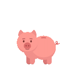
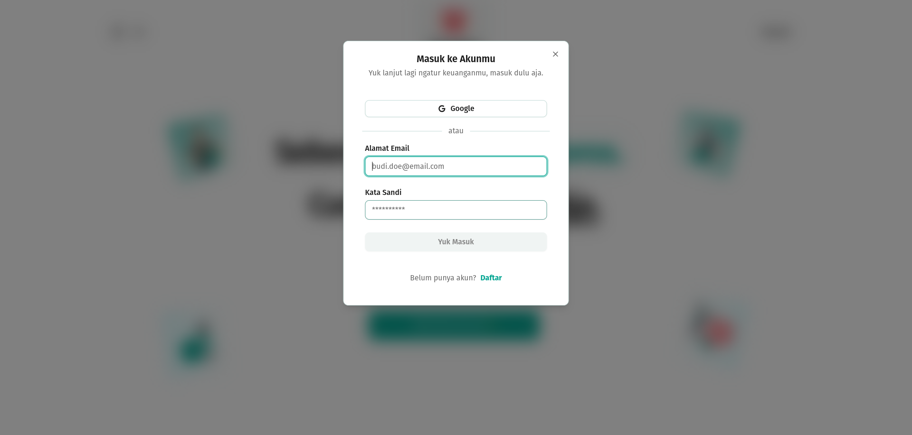
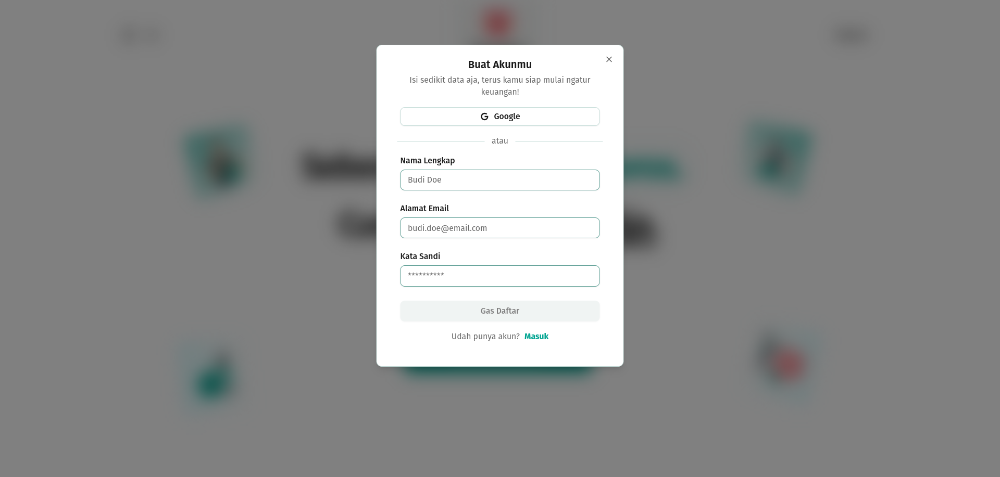
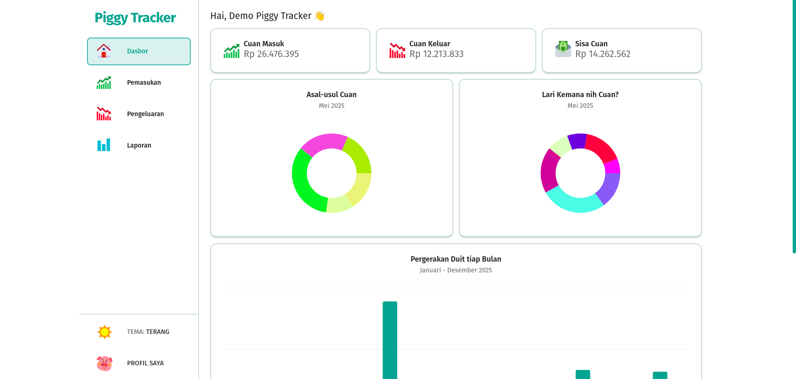
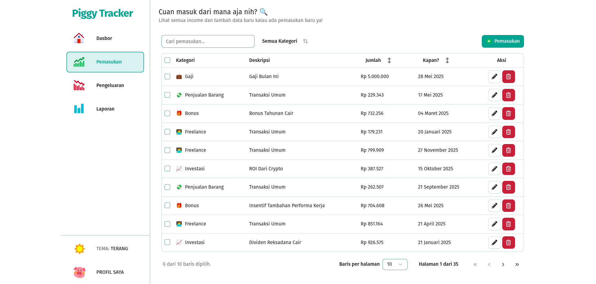
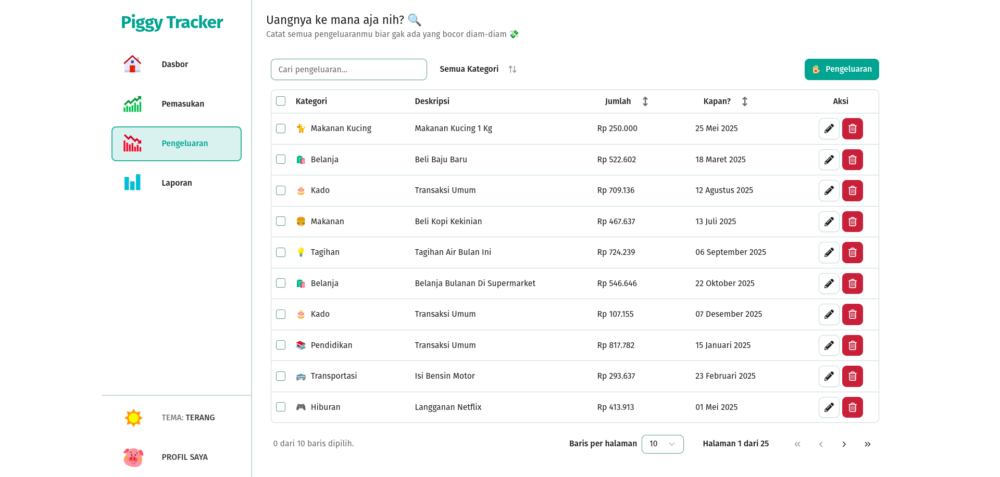
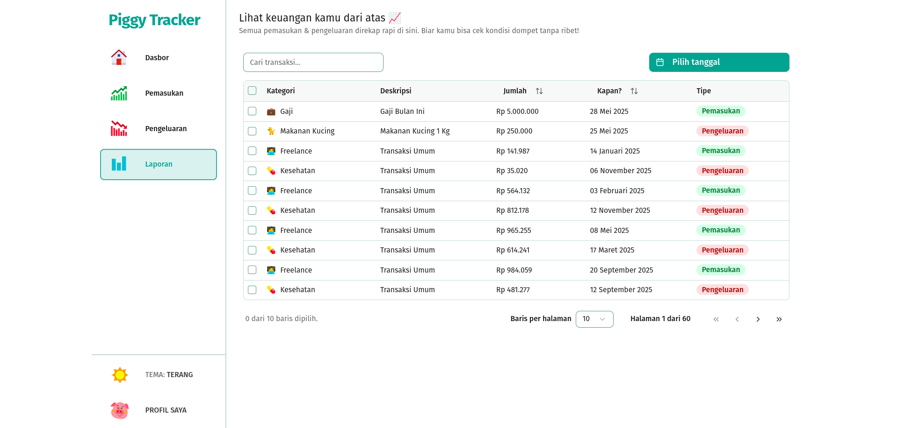

<h1 align="center">🐽 Piggy Tracker 🐽</h1>

<p align="center">Aplikasi pencatatan keuangan yang gemesin, tapi serius ngatur duit 💰📲</p>

<p align="center" style="font-style:italic;">
  <br>
Demo bukan sembarang demo, ini demo tapi bukan di depan istana.
</p>

<p align="center">
  
</p>

<p align="center">
  <a href="https://lottiefiles.com/free-animation/piggy-bank-coins-out-7OAnZ6hKoA">
    🎬 Animasi Piggy (bukan kucing)
  </a>
</p>

---

## 🐷 Apa Itu Piggy Tracker?

Piggy Tracker adalah aplikasi pencatatan keuangan berbasis **web & mobile** yang bikin ngatur duit jadi lebih gampang (dan nggak ngebosenin). Cocok buat kamu yang suka belanja tapi bingung duit kemana 🤔

Dengan **Piggy Tracker**, kamu bisa:

-   Catat pemasukan & pengeluaran
-   Liat histori keuangan kamu
-   Tetap waras pas tanggal tua
-   Dan... ya, setidaknya tau ke mana larinya uang jajan kamu tiap bulan 😅

Cocok banget nih buat **Kamu** yang:

-   Sering bilang "duh, uang gue ke mana ya?"
-   Suka nyatet tapi mager buka Excel
-   Mau tracking keuangan kayak orang dewasa, tapi tetap gaya 😎

---

## 🚀 Teknologi yang Dipakai

Karena aplikasi gemes ini butuh tenaga besar, kami pakai kombinasi teknologi keren:

### 🧠 Backend

-   **Laravel 10** – supaya server-nya ngga baper walau banyak request 🧾
-   **Social Auth (Google)** – login cepet pake akun Google kamu 🚀

### 🎨 Frontend

-   **React 19** – buat tampilan web yang kece dan responsif ⚛️
-   **Tailwind CSS** – styling yang efisien dan gampang di-custom 🎨
-   **shadcn/ui** – komponen UI modern & reusable 🧩
-   **Zod + React Hook Form** – validasi form yang aman dan elegan ✅
-   **Zustand** – state management tanpa drama 🐻
-   **TanStack Table** – buat nampilin data keuangan biar rapi kayak spreadsheet, tapi jauh lebih kece 📊
-   **Sonner** – toast notification yang stylish 🔔

---

## 📱 Fitur-Fitur

✅ Login & register yang smooth kayak mentega <br>
✅ Pencatatan income dan expense (biar gak boncos) <br>
✅ Histori transaksi lengkap <br>
✅ UI lucu dan user-friendly <br>
✅ Bisa diakses dari web dan HP <br>
✅ Dark mode? Tentu dong 🌙✨ <br>
✅ Google Auth? Pake Nanya! 🥴

---

## 🛠️ Cara Setup

Kalau kamu pengen nyobain atau ikut kontribusi, begini caranya:

### 1. Clone dulu repositori ini

```bash
git clone https://github.com/laheluki/piggy-tracker-web.git
cd piggy-tracker-web
```

### 2. Setup Google Auth (Social Auth)

-   Kunjungi [Google Cloud Console](https://console.cloud.google.com)
-   Buat projek baru
-   Buka menu -> APIs & Services ->OAuth Consent Screen
-   Klik get started, Isi Form yang di perlukan(audience eksternal)
-   Buka menu -> APIs & Services -> Credentials
-   Klik Create Credentials -> OAuth Client ID
-   Isi Application type = web
-   Isi Name (bebas)
-   Isi Authorized redirect URIs (**URL_LARAVEL**/api/auth/google/callback)
-   Salin Client ID dan Client Secret kamu, lalu masukkan ke file `.env`.

### 3. Setup Backend

```bash
cp .env.example .env (.env.example -> .env)
composer install
php artisan key:generate
php artisan jwt:secret
php artisan migrate --seed
php artisan serve

```

### 4. Setup Frontend

```bash
npm install
npm run dev
```

---

### ✅ Selesai!

Kalau semua langkah di atas sudah kamu ikuti...

> 🐽 **Selamat!** Kamu resmi jadi **juragan finansial digital** 💼✨
> Saatnya nyatat pengeluaran kayak detektif nyari jejak duit hilang.
> Jangan kaget kalau tiba-tiba sadar: “Wah... ternyata jajan boba tiap hari bisa jadi motor 😅”

---

<br>

<p align="center" style="font-style:italic;">
"Jangan Ngatur Kalo Bukan Donatur 🥶"<br>
~ Alumni akhir bulan
</p>

<br>

> 💩 Maafin ya kalau masih ada bug, namanya juga MVP — _Minimal Versi Paling niat_ 💩

**DEMO :**









